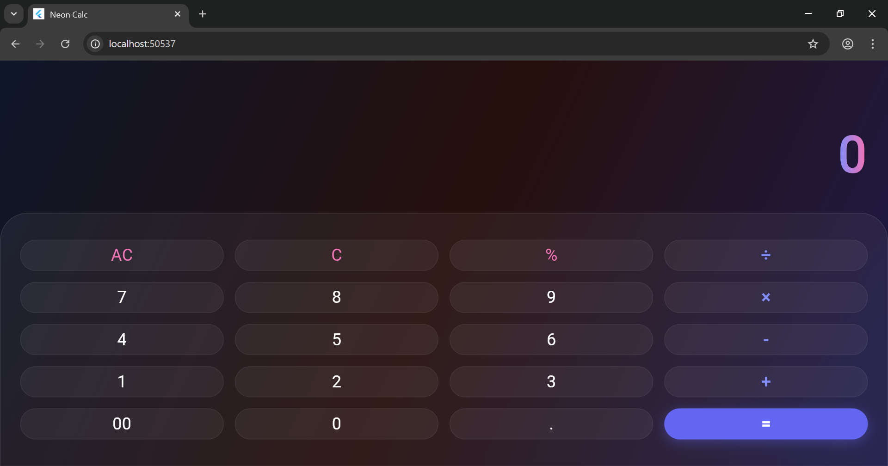

# Experiment 3: GUI Application – Calculator

## Student Information
* **Name:** Kartik Swami
* **Roll Number:** 23EACCS147
* **Batch:** Gamma-1
* **Course:** Computer Science Engineering
* **Experiment Title:** Experiment-3

---

## Aim
To design a simple GUI-based calculator using Flutter widgets.

## Procedure
Flutter provides a rich set of layout and input widgets to build interactive graphical user interfaces. For this experiment, a premium, flashy calculator was developed to perform arithmetic operations with an advanced UI.

1.  **UI Architecture**: Utilized a `Stack` widget to overlay a glassmorphic keypad onto an animated gradient background controlled by an `AnimationController`.
2.  **State Management**: Employed `StatefulWidget` to track the current `_expression` and live `_result` using `setState()`.
3.  **Custom Logic**: Implemented a custom math parser to handle string-based expressions, replacing symbols like '×' and '÷' with standard operators for calculation.
4.  **Advanced Styling**: Integrated `BackdropFilter` for blur effects, `ShaderMask` for gradient text rendering, and `InkWell` for interactive haptic-style feedback on buttons.
5.  **Validation**: Added logic to prevent consecutive operator entry and handle edge cases like division by zero (returning ∞).

### Output
The application successfully compiles and runs, featuring a modern neon-themed interface. It performs real-time incremental calculations as the user types, displaying the final result upon pressing the "=" key.

### Conclusion
By completing this experiment, I have successfully mastered advanced Flutter UI concepts, including animations, glassmorphism, and complex state logic, to create a functional and aesthetically pleasing GUI application.
